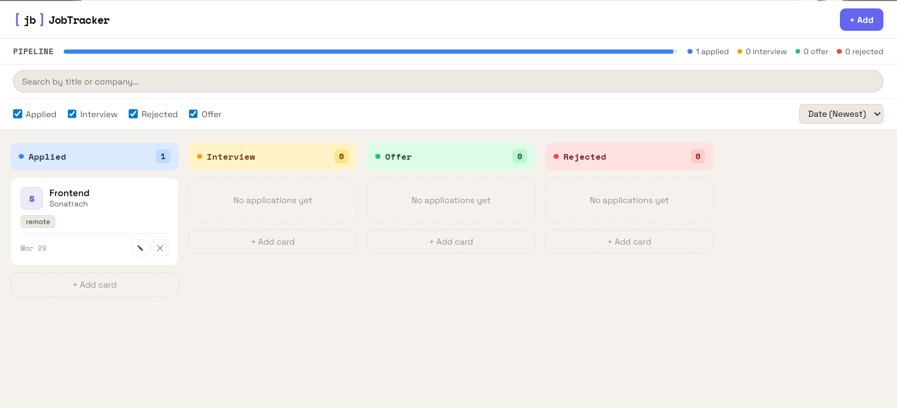

# 💼 Job Tracker

A simple app I built to track job applications using React, TypeScript, and Vite.

---

## 🌐 Live
👉 https://job-tracker-dashboard.netlify.app

---

## 📸 Preview


---

## 🛠️ Built with
- React
- TypeScript
- Vite
- CSS

---

## ✨ What it does
- Add job applications
- Track their status
- Edit or delete entries
- Keep everything organized in one place

---

## ▶️ Run locally
```bash
npm install
npm run dev
